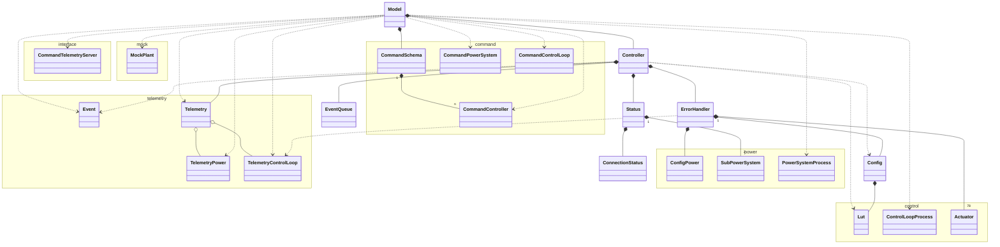
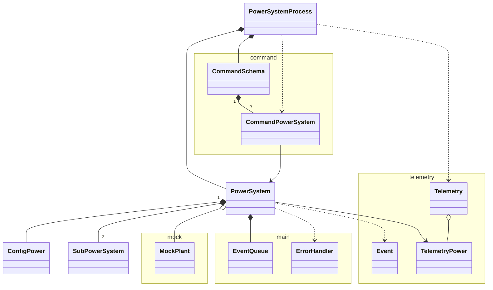
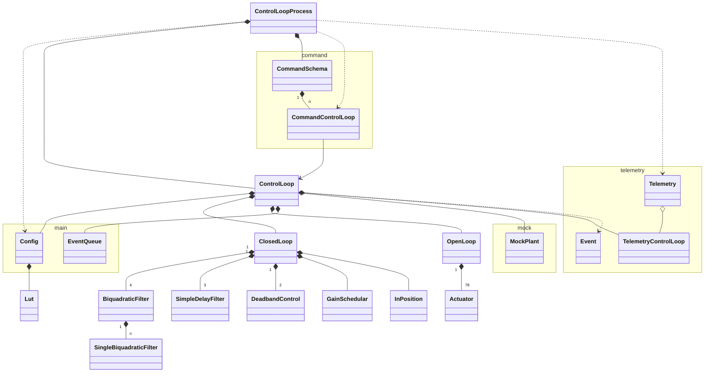
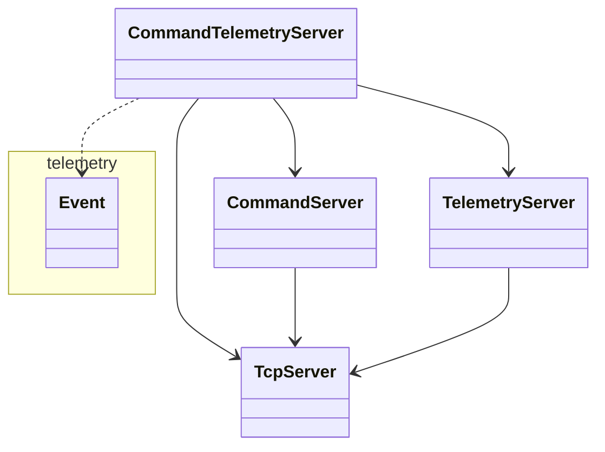
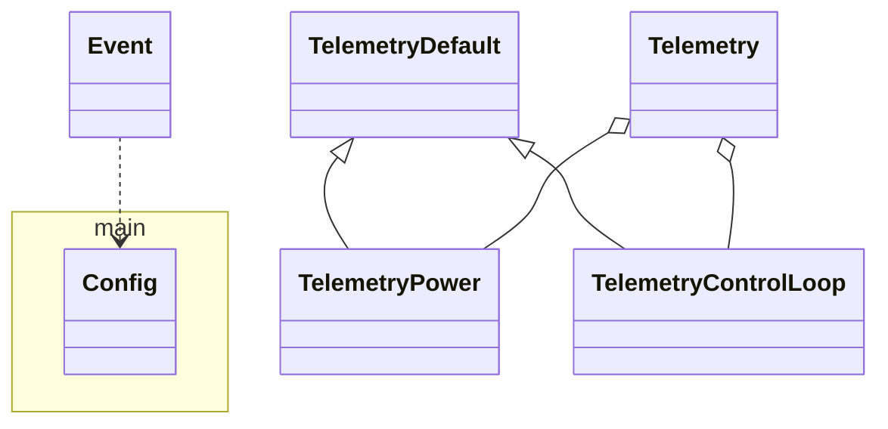
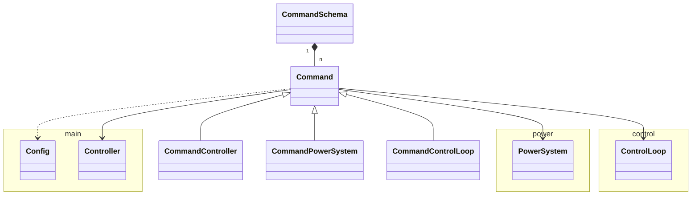
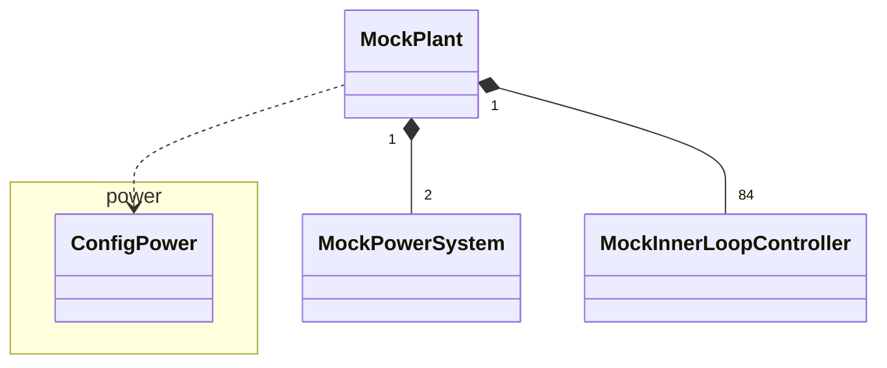

# Class Diagram

The [Model](../src/model.rs) holds the [Controller](../src/controller.rs) to do the main login in the application.
There are the following modules in the control system:

- [power](#power)
- [control](#control)
- [interface](#interface)
- [telemetry](#telemetry)
- [command](#command)
- [mock](#mock)

Show the main class diagram below:

## Power

The [power](../src/power/) module implements the power system:

## Control

The [control](../src/control/) module implements the control loop:

## Interface

The [interface](../src/interface/) module supports the TCP/IP communication:

## Telemetry

The [telemetry](../src/telemetry/) module supports the telemetry and event:

## Command

The [command](../src/command/) module implements the command factory:

## Mock

The [mock](../src/mock/) module supports the simulation mode:

