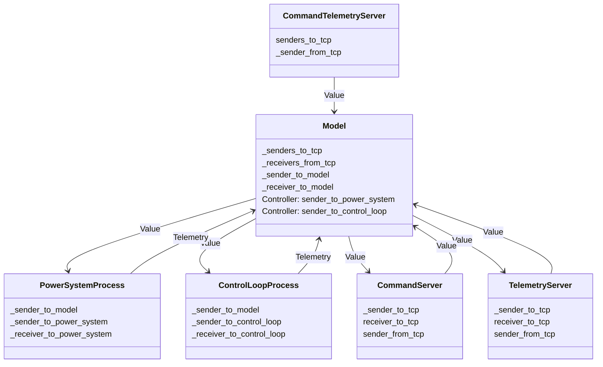

# Communication Diagram

The communication among threads is mainly by the [multi-producer, single-consumer FIFO queue communication](https://doc.rust-lang.org/std/sync/mpsc/index.html).
The only exception are:

- stopping of threads
- connection status (see [CommandTelemetryServer](../src/interface/command_telemetry_server.rs))

, which are by the thread-safe reference-counting pointer, [Arc (atomically reference counted)](https://doc.rust-lang.org/std/sync/struct.Arc.html).

The main thread is the [application](../src/application.rs) that runs the `Model.step()`.
The [Model](../src/model.rs) class holds the [Controller](../src/controller.rs) instance to send the commands to the [PowerSystemProcess](../src/power/power_system_process.rs) and [ControlLoopProcess](../src/control/control_loop_process.rs).
The [CommandTelemetryServer](../src/interface/command_telemetry_server.rs) runs the [CommandServer](../src/interface/command_server.rs) and [TelemetryServer](../src/interface/telemetry_server.rs) as the TCP/IP servers.
The **CommandTelemetryServer** runs a monitor loop to check the connection status and feedbacks to the **Model**.
The exchanged data is the [Value](https://docs.rs/serde_json/latest/serde_json/value/index.html) or [Telemetry](../src/telemetry/telemetry.rs).
For each [Sender](https://doc.rust-lang.org/std/sync/mpsc/struct.Sender.html), there is a related [Receiver](https://doc.rust-lang.org/std/sync/mpsc/struct.Receiver.html) in the class or module.

Since the Mermaid does not support the communication diagram yet, we use the class diagram to mimic the data flow with the association relationship.
Each block is a process in the application and the line's guard is the exchanged data.
Show the communication diagram in the following:

The **CommandServer** receives the command and event from the clients and sends to the **Model** to process.
The **TelemetryServer** subscribes the current elevation angle of telescope mount assemble (TMA) and sends to the **Model**.
The **Model** processes the received command, event, and telemetry, and sends to the **PowerSystemProcess** and **ControlLoopProcess** to do the further processing.
They send the command's result, internal event, and telemetry to the **Model** to forward to the **CommandServer** and **TelemetryServer**.
